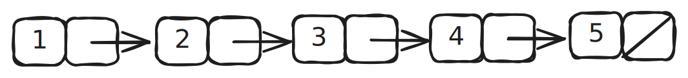
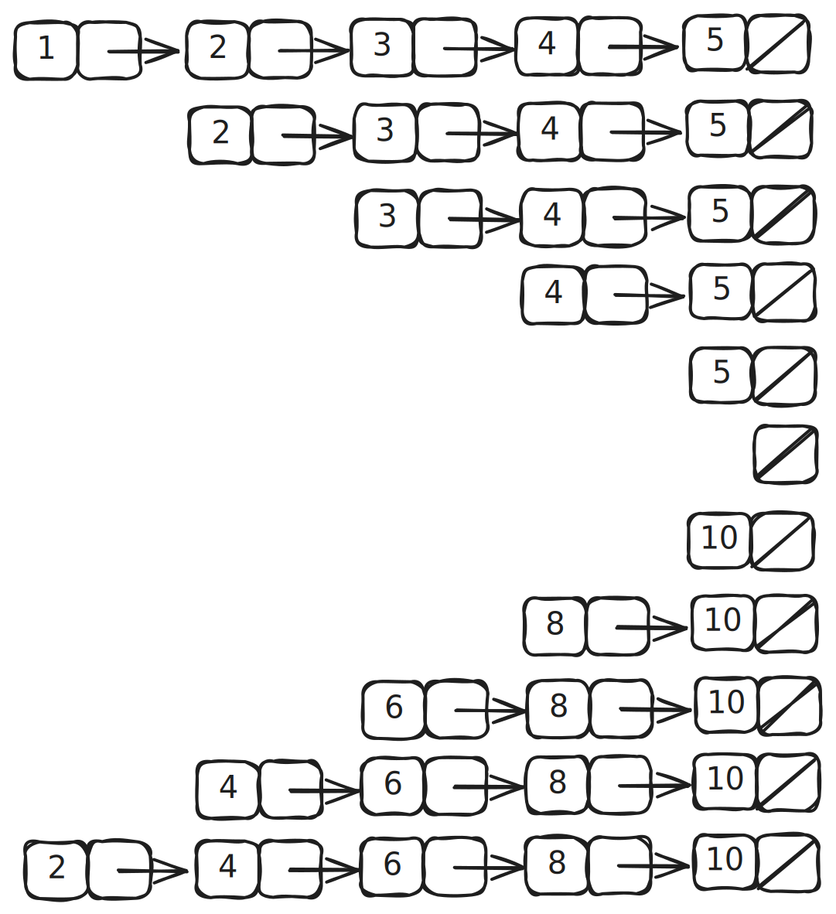

# Lecture Notes for Sep 19, 2025

## Pairs

_Also known as ***cons cells.***_

```scheme
(cons <a> <b>) -> <pair>
```

`cons` is **built into scheme**, and stands for **construct**. Though, that definition probably won't mean anything.

In addition to this doc, read up on [the official Racket documentation](https://docs.racket-lang.org/guide/Pairs__Lists__and_Racket_Syntax.html), just the beginning though.

Other related procedures:

- `cons`: Converts its arguments to a **pair**.
- `car`: Returns first element of **pair**.
- `cdr`: Returns second element of **pair**.
- `pair?`: Returns `#t` if argument is a **pair**.

Examples:

```scheme
> (cons 2 3)
'(2 . 3)
; NOTICE THE LEADING ' AND THE MIDDLE .
; It has very similar syntax to a procedure call/definition

> (car (cons 2 3))
2

> (cdr (cons 2 3))
3
```

## Abstractions

You can use these for your procedural abstractions, like for `x, y` coordinates.

```scheme
> (define (make-coord x y) (cons x y))
> (define (get-x-coord coords) (car coords))
> (define (get-y-coord coords) (cdr coords))

> (define player-1 (make-coord 0 10))
> (define player-2 (make-coord 15 3))
> player-1
'(0 . 10)
> (get-x-coord player-1)
0
> (get-y-coord player-1)
10
```

However, you can use **pairs** for more useful abstractions.

```scheme
> (define (scale point factor)
    (cons (* factor (get-x-coord point))
          (* factor (get-y-coord point))))
> (define (+points point-1 point-2)
    (cons (+ (get-x-coord point-1) (get-x-coord point-2))
          (+ (get-y-coord point-1) (get-y-coord point-2))))
> (define (*points point-1 point-2)
    (cons (* (get-x-coord point-1) (get-x-coord point-2))
          (* (get-y-coord point-1) (get-y-coord point-2))))


> (scale player-1 10)
'(0 . 100)
> (+points player-1 player-2)
'(15 . 13)
> (*points player-1 player-2)
'(0 . 30)

; In theory, you could also make abstractions for other features
; like motion, vectors, resistance, etc.
```

**Abstractions** such as these, along with ones you create, are intended to mask the **lower-level actions** that are repetitively ran. Once these **abstractions** are created/defined once, you can just use it. The _how_ behind an abstraction doesn't matter. It's just a tool that you can freely use. _Just make sure you name your procedures/abstractions well!_

However, just because the implementation of the **abstraction** doesn't typically matter, it's _sometimes_ important to understand the costs of running these **abstractions**.

## Lists

Lists in scheme are implemented as **linked lists**.

```scheme
> (define my-list (list 1 2 3 4 5))
> my-list
'(1 2 3 4 5)
> (car my-list)
1
> (cdr my-list)
'(2 3 4 5)
> (cdr (cdr my-list))
'(3 4 5)
```



## Map

A **map** applies an **operation** to a **list**. Examples of **operations** include scaling and filtering.

Take the following example:

```scheme
(define (map proc input-list)
    (if (null? lst)
        '()
        (cons (proc (cat lst))
            (map (proc cdr lst)))))
```

If you want to multiply all elements in the list by 2, you could call the procedure like:

```scheme
> (define (double x)
    (* x 2))
> my-list
'(1 2 3 4 5)
> (map double my-list)
'(2 4 6 8 10)
```



